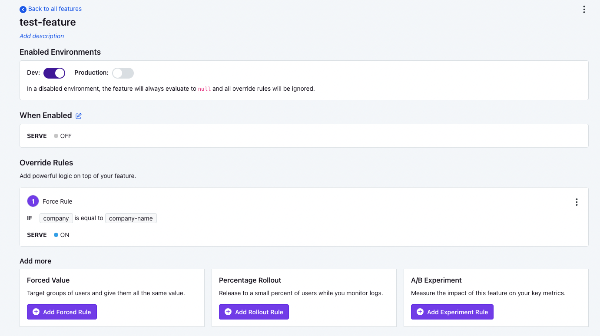
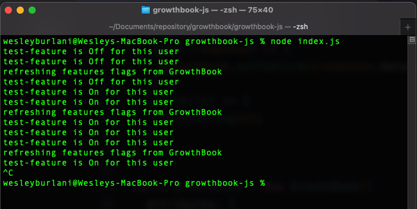

# Growthbook Feature Flagging Test

A nodeJS example of usage of [GrowthBook](https://github.com/growthbook/growthbook).

This code assumes the usage of the self hosted version of Growthbook. (Access their GitHub page to install it).

To execute this test you should install Growthbook locally (you can install using [docker-compose](https://docs.docker.com/compose/)) and then, configuring a feature flag there.

At this example, I've defined a feature flag named `test-feature` that will be on, only if the attribute company is `company-name`. 

## Code Configuration

Now, in the code, we should configure `.env` file. 

Copy and paste `.env.example` and rename it to `.env`, then fill the value of the presented variables.

* GROWTHBOOK_DOMAIN: If you are using local docker installation will be `http://localhost:3100`
* GROWTHBOOK_API_KEY: you can get it accessing GrowBook local panel and go to `Settings > API Keys`
* FEATURE_FLAG_DEFINED: the name of the feature flag you have defined
* COMPANY_NAME: in my case, since I defined a flag based on the company name, it easily changes the company name.

## Explanation

this code will refresh feature flag values each 3 seconds. Making an API request to GrowthBook and each 1 second it will check the feature flag state.

Output example: 

